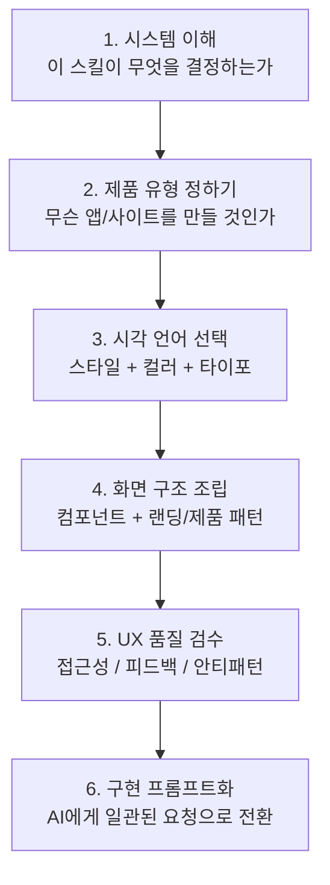

# UI/UX Pro Max 학습 경로

이 문서는 UI/UX Pro Max를 **스타일 백과사전**이 아니라 **디자인 의사결정 시스템**으로 익히기 위한 학습 순서를 제시한다.

핵심 원칙은 이렇다.

> **스타일 하나를 고르는 데서 시작하지 말고, 제품 유형 → 출력 패턴 → 스타일/컬러/타이포 → 컴포넌트 → UX 검수 순서로 올라가라.**

---

## 학습 경로 개요



---

## 트랙 1 — 처음 쓰는 사용자

### 목표

- 이 스킬이 단순 스타일 모음이 아니라는 점 이해
- 제품 유형과 결과물 유형을 먼저 정하는 습관 만들기
- categories 문서를 단순 취향 탐색이 아니라 설계 결정 순서로 읽기

### 먼저 읽을 문서

1. `README.md`
2. `sections/01-overview.md`
3. `categories/overview.md`
4. `02-glossary.md`

### 여기서 먼저 잡아야 할 것

- 이 스킬은 무엇을 입력으로 받는가
- 어떤 축으로 추천을 만드는가
- 어떤 결과물을 만들어 주는가
- 왜 스타일보다 제품 유형이 먼저인가

### 성공 기준

- “예쁜 스타일 추천기”와 “디자인 결정 시스템”의 차이를 설명할 수 있다
- 제품군을 먼저 정해야 하는 이유를 안다

---

## 트랙 2 — UI 설계자 / 구현자

### 목표

- 실제 화면을 만들 때 어떤 순서로 스킬을 호출해야 하는지 익힘
- 스타일, 팔레트, 폰트, 컴포넌트, 화면 구조를 한 번에 묶어 판단
- 결과를 구현용 프롬프트로 변환할 수 있음

### 추천 읽기 순서

1. `categories/products-landing.md`
2. `categories/ui-styles.md`
3. `categories/colors-fonts.md`
4. `categories/components.md`
5. `categories/ux-guidelines.md`

### 권장 작업 순서

#### 1단계 — 제품 유형과 목표 화면을 정한다

예:
- SaaS 대시보드
- 이커머스 랜딩 페이지
- 모바일 웰니스 앱
- 포트폴리오 사이트

#### 2단계 — 시각 언어를 정한다

- 어떤 스타일이 맞는가
- 어떤 산업용 팔레트가 맞는가
- 어떤 폰트 성격이 맞는가

#### 3단계 — 조립 단위를 정한다

- 카드 / 테이블 / 차트 / 모달 / CTA
- Hero / Social Proof / Feature / Testimonial / Bottom CTA

#### 4단계 — 마지막에 UX 기준으로 검수한다

- 명도 대비
- tap target
- 에러 메시지
- hover / pressed state
- motion / reduced motion

### 실전 프롬프트 구조

```text
제품 유형 + 목표 화면 + 스타일 + 컬러 방향 + 타이포 방향 + 핵심 컴포넌트 + UX 제약
```

예:

```text
B2B SaaS용 관리자 대시보드를 만들어줘.
스타일은 Minimalism & Swiss Style.
컬러는 신뢰감 있는 blue 계열 팔레트.
타이포는 modern professional 계열.
사이드바, KPI 카드, line chart, data table이 필요해.
hover/focus state와 WCAG 대비를 지켜줘.
```

### 성공 기준

- categories 문서를 읽고 구현 프롬프트로 재조합할 수 있다
- “예쁜 UI”가 아니라 “일관된 UI 결정 세트”를 요청할 수 있다

---

## 트랙 3 — 디자인 시스템/프롬프트 엔지니어

### 목표

- 원본이 가진 reasoning-engine 성격을 이해
- 스타일 추천이 아니라 multi-domain recommendation 구조를 읽음
- CLI/skill product 관점까지 연결한다

### 먼저 읽을 문서

1. `README.md`의 v2.0 설명
2. `sections/01-overview.md`
3. `categories/overview.md`
4. `02-glossary.md`

### 중점적으로 볼 것

- 161개 산업 규칙이 왜 중요한가
- BM25 기반 검색/우선순위 개념이 왜 언급되는가
- design system generation 결과가 왜 패턴 + 스타일 + 컬러 + 타이포 + checklist 묶음인지
- 왜 CLI와 skill metadata가 별도 표면으로 존재하는가

### 성공 기준

- 이 스킬을 “지식 데이터 + 추천 규칙 + 설치 가능한 제품”으로 설명할 수 있다
- 단순 디자인 문서와 이 저장소의 차이를 말할 수 있다

---

## 가장 추천하는 읽기 순서

### 빠른 실무용 순서

1. `sections/01-overview.md`
2. `categories/products-landing.md`
3. `categories/ui-styles.md`
4. `categories/colors-fonts.md`
5. `categories/components.md`
6. `categories/ux-guidelines.md`
7. `02-glossary.md`

### 저장소 이해용 순서

1. `README.md`
2. `sections/01-overview.md`
3. `categories/overview.md`
4. `01-learning-paths.md`
5. `02-glossary.md`

---

## 자주 틀리는 학습 순서

### 잘못된 순서 1

`색상표부터 고르기`

왜 틀리나:
- 컬러는 제품 유형과 스타일 문맥 없이 고르면 쉽게 뜬다

### 잘못된 순서 2

`스타일 하나만 정하고 끝내기`

왜 틀리나:
- 이 스킬의 진짜 강점은 스타일 + 팔레트 + 타이포 + UX 규칙의 묶음이다

### 잘못된 순서 3

`컴포넌트를 먼저 디테일하게 파기`

왜 틀리나:
- 화면 구조와 패턴이 먼저 정해져야 컴포넌트도 올바르게 배치된다

---

## 최종 체크리스트

- [ ] 제품 유형을 먼저 정했다
- [ ] 목표 화면 유형을 정했다
- [ ] 스타일 / 컬러 / 타이포를 함께 선택했다
- [ ] 핵심 컴포넌트를 정의했다
- [ ] UX 가이드라인으로 마지막 검수를 걸었다
- [ ] 최종 요청을 구현 프롬프트 한 문장으로 압축할 수 있다

---

## 다음 문서

- 시스템 관점 개요는 `sections/01-overview.md`
- 실제 category 기반 탐색은 `categories/`
- 용어 정리는 `02-glossary.md`
