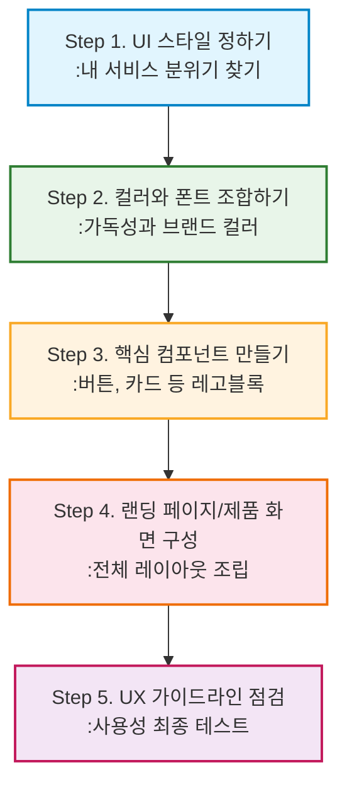

# 🎨 UI/UX Pro Max 스킬 실전 가이드에 오신 것을 환영합니다!

안녕하세요! 👋 
이 가이드는 디자인 경험이 부족한 **개발자, 기획자(PM), 일반 사용자**가 AI(ui-ux-pro-max 스킬)의 도움을 받아 **전문 디자이너 수준의 웹/앱 화면을 기획하고 구현할 수 있도록** 돕기 위해 만들어졌습니다.

어렵고 복잡한 디자인 이론 대신, **"AI에게 어떻게 질문하고 어떤 결과를 얻어야 하는지"**에 집중하여 아주 쉽고 친절하게 단계별로(Step-by-Step) 안내해 드립니다.

---

## 🎯 이 가이드는 누구를 위한 것인가요?

- 👩‍💻 **개발자 & 기획자(PM)**: "기능은 다 만들었는데 디자인이 너무 안 예뻐요. 깔끔하고 트렌디하게 바꾸고 싶어요!"
- 🎨 **주니어 디자이너**: "새로운 프로젝트를 시작할 때 다양한 스타일과 폰트 조합 아이디어를 AI로 빠르게 얻고 싶어요!"
- 🙋‍♂️ **일반 사용자**: "머릿속에 있는 나만의 앱 아이디어를 그럴듯한 화면으로 구체화해보고 싶어요!"

---

## 📚 어떻게 학습해야 할까요? (Step-by-Step 가이드)

무엇부터 봐야 할지 막막하시다면 아래의 시각화된 흐름도를 따라가 보세요.

1. **[학습 경로 가이드 (01-learning-paths.md)](./01-learning-paths.md)**
   - 가장 먼저 읽어보세요! 주차별로 어떤 순서로 디자인을 기획해야 하는지 전체적인 로드맵을 알려드립니다.
2. **[디자인 용어 사전 (02-glossary.md)](./02-glossary.md)**
   - 가이드를 읽다가 모르는 단어가 나오면 여기서 찾아보세요. 어려운 영단어를 쉬운 우리말로 풀었습니다.

**[본격적인 디자인 카테고리 (categories/)]**
*아래 순서대로 차근차근 나만의 디자인을 완성해 보세요.*

* **Step 1.** 🎭 [UI 스타일 정하기](./categories/ui-styles.md) - 내 서비스에 맞는 분위기(미니멀리즘, 3D 등) 고르기
* **Step 2.** 🎨 [컬러와 폰트 조합하기](./categories/colors-fonts.md) - 촌스럽지 않은 색상과 글꼴 매칭하기
* **Step 3.** 🧩 [핵심 컴포넌트 만들기](./categories/components.md) - 버튼, 카드, 내비게이션 바 조립하기
* **Step 4.** 🚀 [랜딩 페이지 & 제품 화면 구성](./categories/products-landing.md) - 대시보드나 쇼핑몰 등 실제 화면 구조 잡기
* **Step 5.** ✅ [UX 가이드라인 점검](./categories/ux-guidelines.md) - 사용자가 불편해하지 않도록 마지막 필수 점검하기

---

## 💡 AI 스킬 사용 꿀팁!

이 가이드에 있는 내용들을 직접 다 코딩하거나 그릴 필요가 없습니다! 
Gemini CLI 창에서 다음과 같이 **명령어(프롬프트)를 입력**하기만 하면 됩니다.

> **"ui-ux-pro-max 스킬을 사용해서, [UI 스타일] 문서에 있는 '미니멀리즘' 스타일로 [제품 화면] 문서에 있는 'SaaS 대시보드' 형태의 UI 코드를 작성해 줘. 색상은 파란색(Primary)을 메인으로 해줘."**

준비되셨나요? 그럼 첫 번째 관문인 [학습 경로 가이드](./01-learning-paths.md)로 이동해 볼까요? 🚀

---

## 🙏 감사의 글 및 원본 프로젝트 안내 (Acknowledgements)

이 가이드는 **NextLevelBuilder**(mrgoonie)님이 개발한 훌륭한 오픈소스 AI 스킬인 [**UI/UX Pro Max Skill**](https://github.com/nextlevelbuilder/ui-ux-pro-max-skill)을 바탕으로, 디자인 초보자들도 쉽게 이해하고 활용할 수 있도록 재구성된 학습용 가이드입니다.

* **원본 프로젝트**: [ui-ux-pro-max-skill (GitHub)](https://github.com/nextlevelbuilder/ui-ux-pro-max-skill)
* **원작자**: NextLevelBuilder (mrgoonie)
* **원본 프로젝트 소개**: UI/UX Pro Max Skill은 AI 어시스턴트(Gemini CLI, Claude Code, Cursor 등)에게 '전문 디자이너의 지능(Reasoning Engine)'을 부여하는 강력한 도구입니다. 단순한 텍스트 프롬프트를 67가지 UI 스타일, 161개 산업군별 컬러 팔레트, 57가지 폰트 조합 등 방대한 전문 지식을 기반으로 한 고품질의 UI/UX 코드로 변환해 줍니다. 

원작자의 뛰어난 통찰력과 오픈소스 생태계에 대한 기여에 깊은 감사를 드립니다. 원본 스킬의 세부적인 기능과 최신 업데이트 내역은 위 GitHub 링크를 통해 확인하시기 바랍니다.
