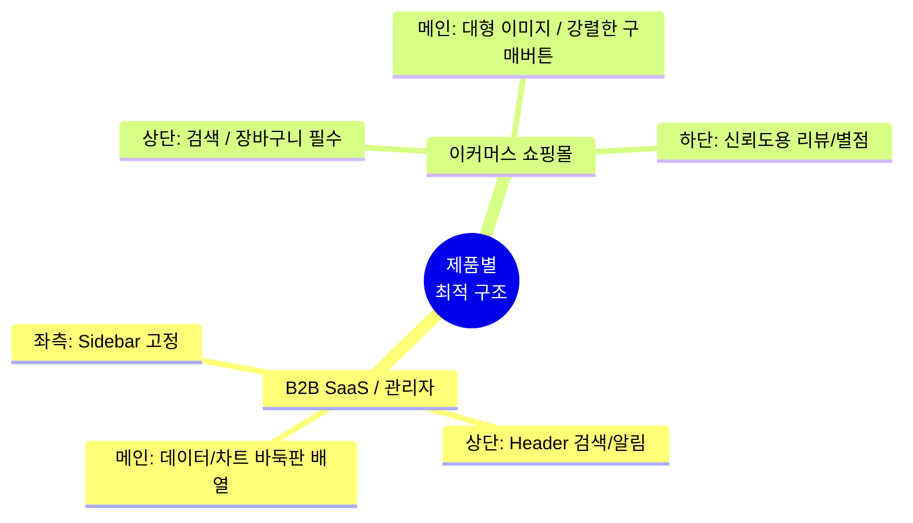
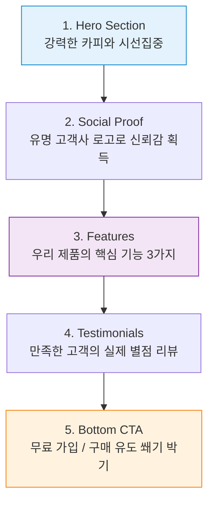

# 5️⃣ 제품 및 랜딩 페이지 (Products & Landing)

## 카테고리 소개
스타일, 색상, 컴포넌트를 모두 배웠다면 이제 하나로 합쳐서 **완성된 페이지**를 그릴 차례입니다. 
서비스의 목적에 따라 화면의 구조는 완전히 달라야 합니다.

---

## 🏗️ 1. 제품군별 최적의 구조

내가 만들려는 서비스가 어느 쪽에 속하는지 확인하고, AI에게 해당 구조를 요청하세요.

### 💼 B2B SaaS / 관리자 대시보드 (Admin Dashboard)
업무용으로 쓰는 툴이므로 '데이터를 한눈에 파악'하고 '효율적으로 작업'하는 것이 핵심입니다.
* **화면 구조**:
  * **좌측 (Sidebar)**: 좁은 세로 영역에 전체 메뉴(홈, 사용자 관리, 설정 등)를 고정으로 배치합니다.
  * **상단 (Header)**: 현재 페이지 이름, 검색창, 사용자 프로필, 알림 버튼을 배치합니다.
  * **메인 (Content)**: 넓은 화면에 차트, 요약 카드, 데이터 표(Table)를 바둑판(Grid)처럼 배치합니다.

### 🛒 이커머스 쇼핑몰 (E-Commerce)
사용자가 상품에 매력을 느끼고 '구매 버튼을 누르게' 만드는 것이 핵심입니다.
* **화면 구조**:
  * **상단 (Header)**: 로고, 검색창, 그리고 가장 중요한 **'장바구니' 아이콘**을 우측에 둡니다.
  * **메인 (Content)**: 상품의 고화질 이미지를 가장 크게 보여주고, 제품명과 가격, 그리고 강렬한 색상의 '구매하기' CTA 버튼을 배치합니다.
  * **하단 (Reviews)**: 사용자들이 남긴 별점과 리뷰 카드를 배치해 신뢰도를 높입니다.

---

## 🚀 2. 방문자를 고객으로 만드는 랜딩 페이지 공식

우리 제품을 홍보하는 웹페이지(Landing Page)를 만들 때는, 사용자가 스크롤을 내리면서 설득되도록 아래의 순서를 지키는 것이 좋습니다.

1. **히어로 섹션 (Hero) - 첫인상**: "우리가 당신의 어떤 문제를 해결해 줄 수 있습니다!"라는 강력한 한 줄의 문구와 이메일 입력창(또는 시작 버튼).
2. **소셜 프루프 (Social Proof) - 신뢰감**: "이미 구글, 삼성 같은 유명 기업들이 우리를 씁니다." (로고 배치)
3. **핵심 기능 (Features) - 설명**: 우리 제품의 핵심 기능 3가지를 아이콘이나 짤막한 영상과 함께 가로로 나란히 배치.
4. **고객 후기 (Testimonials) - 확신**: 실제 고객의 사진과 별점 5개짜리 리뷰 멘트.
5. **하단 CTA (Bottom CTA) - 쐐기 박기**: 스크롤을 다 내린 고객에게 다시 한번 "지금 가입하고 한 달 무료 혜택을 받으세요!"라며 마지막 가입 버튼을 제시.

> 💬 **AI 프롬프트 예시:**
> *"제품 홍보용 랜딩 페이지 전체를 만들어줘. 순서는 히어로 섹션 -> 신뢰를 주는 기업 로고들 -> 핵심 기능 3가지 설명 -> 마지막 CTA 버튼 순으로 정석적인 랜딩 페이지 공식을 따라줘."*
