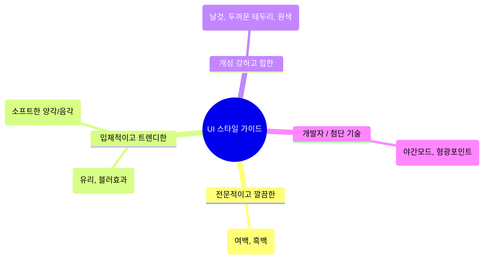

<!-- GENERATED BY build_obsidian_vaults.py -->
# Ui styles

[[ui-ux-pro-max skills Guide - MOC]]

> [!info]
> source: `categories/ui-styles.md`  
> role: `category`

## Why this note matters

내 서비스에 옷을 입힌다면 어떤 스타일이 좋을까요? 단정하고 깔끔한 정장? 아니면 톡톡 튀는 힙합 스타일? 여기 가장 트렌디하고 많이 쓰이는 **핵심 UI 스타일 5가지**를 소개합니다. AI에게 코드를 요청할 때 이 키워드들을 활용해 보세요.

## Source-adapted content

# 1️⃣ UI 스타일 (UI Styles)

## 카테고리 소개
내 서비스에 옷을 입힌다면 어떤 스타일이 좋을까요? 단정하고 깔끔한 정장? 아니면 톡톡 튀는 힙합 스타일?
여기 가장 트렌디하고 많이 쓰이는 **핵심 UI 스타일 5가지**를 소개합니다. AI에게 코드를 요청할 때 이 키워드들을 활용해 보세요.

---

### 1. 미니멀리즘 & 스위스 스타일 (Minimalism)
가장 기본적이면서도 실패 확률이 적은 깔끔한 스타일입니다.

* **✨ 특징/키워드**: 여백의 미, 깔끔함, 흑백(고대비), 장식 없음, 직관적
* **👍 추천 서비스**: 기업용 대시보드(B2B SaaS), 포트폴리오, 문서 사이트
* **✅ 체크리스트**:
  * [ ] 불필요한 그림자나 그라데이션을 뺐는가?
  * [ ] 글자 크기(제목과 본문)의 차이가 명확한가?
  * [ ] 요소들 사이의 간격(여백)이 충분히 넓은가?
* **💬 프롬프트 예시**:
  > "미니멀리즘 스타일로 디자인해 줘. 그림자 효과는 다 빼고, 여백을 충분히 주며 흑백 톤에 포인트 컬러 딱 하나만 사용해 줘."

### 2. 글래스모피즘 (Glassmorphism)
화면 위에 반투명한 유리를 얹은 듯한 세련되고 현대적인 느낌을 줍니다.

* **✨ 특징/키워드**: 불투명한 유리 느낌, 배경 블러(Blur), 은은한 깊이감, 화려한 뒷배경
* **👍 추천 서비스**: 최신 금융/핀테크 앱, 프리미엄 브랜드 사이트, 모달 팝업창
* **✅ 체크리스트**:
  * [ ] 배경에 생동감 있는 색상을 깔았는가?
  * [ ] 유리 질감을 위해 `backdrop-filter: blur` 효과를 주었는가?
  * [ ] 카드 테두리에 아주 얇고 투명한 흰색 선을 넣었는가?
* **💬 프롬프트 예시**:
  > "뒷배경이 은은하게 비치는 글래스모피즘 스타일 카드를 만들어 줘. 테두리는 아주 얇고 투명하게 해줘."

### 3. 뉴모피즘 (Neumorphism)
부드러운 플라스틱을 꾹 누르는 듯한 입체감을 주는 디자인입니다.

* **✨ 특징/키워드**: 부드러운 입체감, 음각/양각, 파스텔 톤, 둥근 모서리
* **👍 추천 서비스**: 명상 앱, 피트니스 트래커, 스마트홈 제어기
* **✅ 체크리스트**:
  * [ ] 배경색과 버튼색이 완전히 동일한가? (그림자로만 구분)
  * [ ] 밝은 그림자와 어두운 그림자를 양쪽에 배치해 입체감을 주었는가?
  * [ ] 모서리를 부드럽게 둥글렸는가?
* **💬 프롬프트 예시**:
  > "배경과 버튼 색상을 똑같은 연한 회색으로 맞추고, 빛과 그림자만 이용해 버튼이 튀어나온 것처럼 보이는 뉴모피즘 스타일로 해줘."

### 4. 브루탈리즘 (Brutalism)
규칙을 깬듯한 거칠고 강렬한 스타일로, 젊고 힙한 느낌을 강하게 줍니다.

* **✨ 특징/키워드**: 날것의 느낌, 엄청나게 큰 텍스트, 굵은 테두리 뚜렷함, 원색(빨강, 파랑 등)
* **👍 추천 서비스**: 예술가 포트폴리오, 패션/스트릿 브랜드, 이벤트 프로모션 페이지
* **✅ 체크리스트**:
  * [ ] 테두리가 아주 두껍고 진한가? (예: `border: 3px solid black`)
  * [ ] 모서리가 둥글지 않고 완벽한 직각(0px)인가?
  * [ ] 애니메이션이나 부드러운 효과를 모두 뺐는가?
* **💬 프롬프트 예시**:
  > "굵은 검은색 테두리와 원색(노랑, 빨강)을 사용한 브루탈리즘 스타일로 해줘. 모서리는 절대 둥글게 하지 말고 뾰족하게 둬."

### 5. 다크 & 네온 (Dark & Neon)
어두운 밤하늘에 빛나는 네온사인처럼, 개발자나 게이머들이 열광하는 스타일입니다.

* **✨ 특징/키워드**: 검은색/진회색 배경, 형광색 포인트, 야간 모드, 첨단 기술 느낌
* **👍 추천 서비스**: 개발자 도구, 암호화폐 거래소, 게임 관련 서비스, AI 서비스
* **✅ 체크리스트**:
  * [ ] 배경이 완전한 검정(#000000)보다는 아주 짙은 회색(예: #111111)인가?
  * [ ] 포인트 컬러(예: 형광 보라, 형광 초록)가 눈에 확 띄는가?
  * [ ] 어두운 배경에서도 글씨(흰색/밝은 회색)가 잘 읽히는가?
* **💬 프롬프트 예시**:
  > "배경은 아주 짙은 회색으로 하고, 사이버펑크 느낌이 나도록 네온 블루(#00F0FF)를 포인트 컬러로 쓰는 다크 모드 스타일로 구성해 줘."
