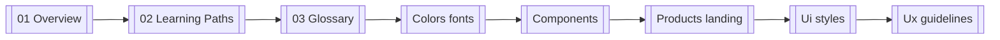

<!-- GENERATED BY build_obsidian_vaults.py -->
# ui-ux-pro-max skills Guide - MOC

> [!info]
> output mode: hybrid  
> repo guide: `ui-ux-pro-max-skills-guide/`  
> repo-local note pack: `obsidian/ui-ux-pro-max skills Guide/`  
> live vault target: `unset`  
> live sync status: `not applied`

## What this vault set is for

안녕하세요! 👋 이 가이드는 디자인 경험이 부족한 **개발자, 기획자(PM), 일반 사용자**가 AI(ui-ux-pro-max 스킬)의 도움을 받아 **전문 디자이너 수준의 웹/앱 화면을 기획하고 구현할 수 있도록** 돕기 위해 만들어졌습니다.

## Start here

1. [[01 Overview]]
2. [[02 Learning Paths]]
3. [[03 Glossary]]
4. [[Categories/Colors fonts]]
5. [[Categories/Components]]
6. [[Categories/Products landing]]
7. [[Categories/Ui styles]]
8. [[Categories/Ux guidelines]]

## Reading graph

## Note map by purpose

### Categories
- [[Categories/Colors fonts]]
- [[Categories/Components]]
- [[Categories/Products landing]]
- [[Categories/Ui styles]]
- [[Categories/Ux guidelines]]
### Frontdoor
- [[01 Overview]]
- [[02 Learning Paths]]
- [[03 Glossary]]

## Safety rule

> [!warning]
> repo-local pack가 정본이다. live vault sync는 의도된 target이 명시적으로 정해지기 전까지 보류한다.

## Repo links

- repo frontdoor: `README.md`
- repo ↔ note mapping: `OBSIDIAN-VAULT-MAP.md`
- sync evidence: `UPSTREAM-SNAPSHOT.md`, `SYNC-LOG.md`
